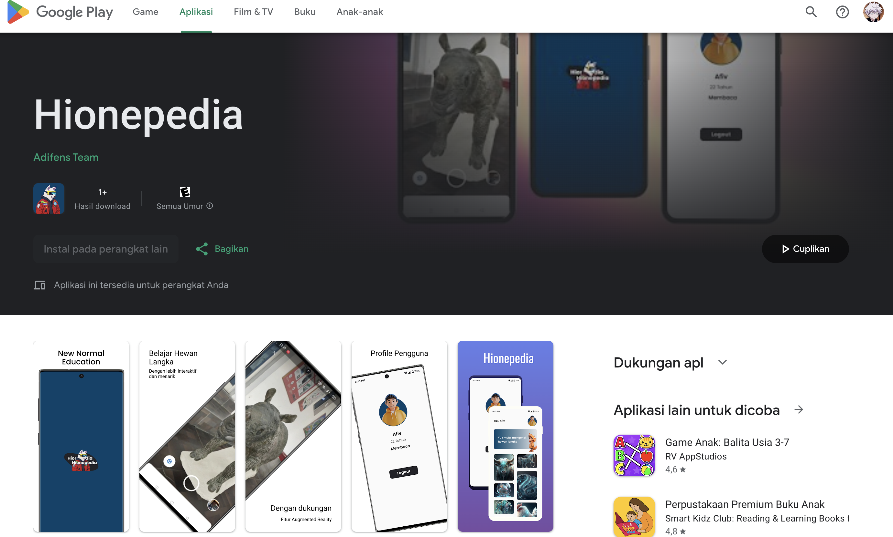

# Hionepedia

Hionepedia merupakan aplikasi pembelajaran hewan langka menggunakan teknologi AR  

### Features

- Menggunakan Provider State Management
- Menggunakan MVVM Design Pattern
- Menggunakan Hive Storage
- Memiliki Fitur 3D Model
- Memiliki Fitur Augmented Reality
- Memiliki Fitur Suara Hewan

<!-- ### Preview -->

|                                                       |                                                 
| ----------------------------------------------------- | 
| Playstore                                           |                                      
|      |  
